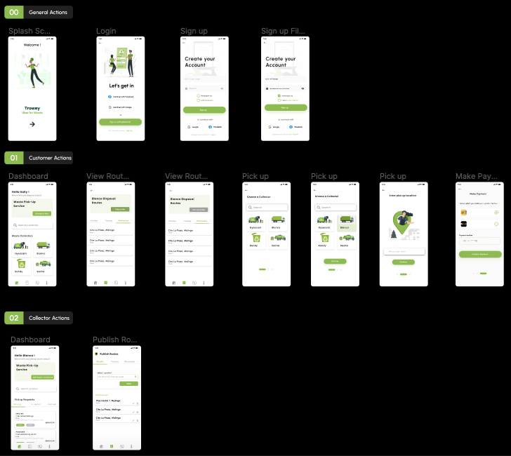
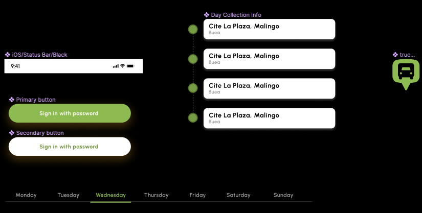
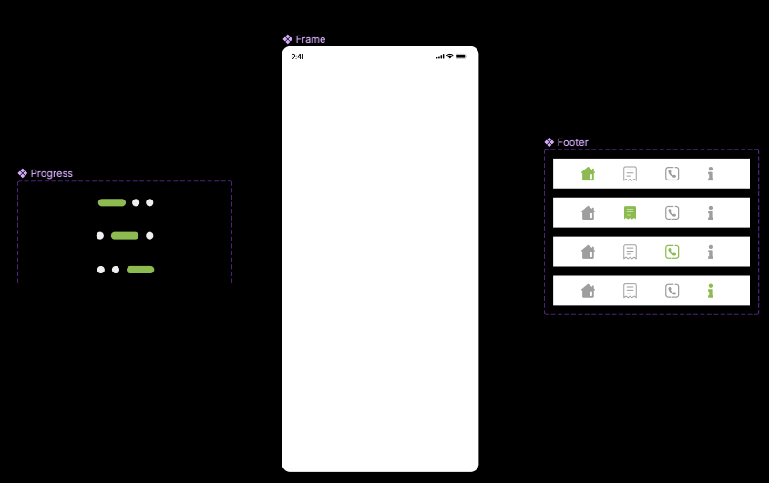
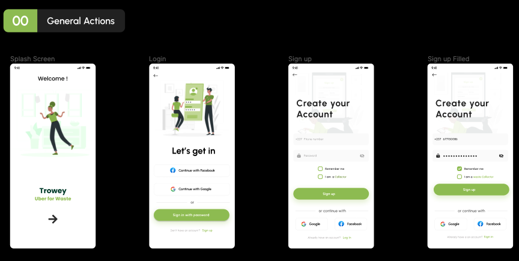
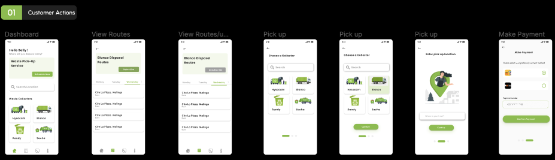
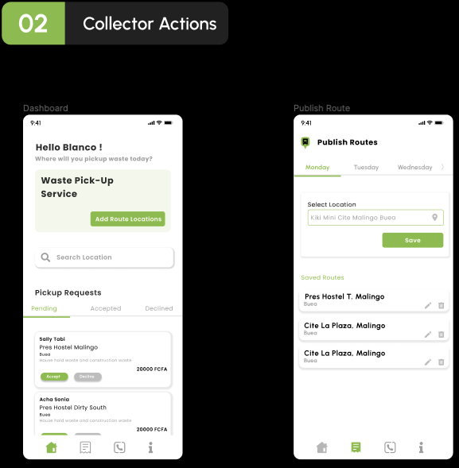

# Trowey - A Waste Management Software

## Design Overview

The designing was done using Figma. Using the modular approach, smaller components were first built and then 
integrated to form the larger components. These components included buttons, navigation bars, built icons frames 
and menus.

### Modular Components
  

## Implementation

### General Actions

These are screens that would be accessed by both waste collectors and customers. They include:
    - The splash screen
    - Login Screen (Logging in with google and with password)
    - The Signup screen

The user would be able to login with their phone number and password or by using google or facebook authentication 
methods however, this has not been implemented in the current project.

The user should also be able to signup by providing the required user information. 

Upon signing in or signup up, the user can select if they are a Waste Collector,, if not, they'll be treated like 
Customers and would be limited to the interactions of customers.

### Customer Actions

When the customer logs in, they'll be able to view all Collectors and have the possibility of searching for collectors 
by location. The base unit element of this page would be the Collector and each collector would have a name displayed.

Clicking on a collector would display their routes for each day of the week. Also, the customer should be able to 
subscribe or unsubscibe to a collector by clicking on the Subscribe or Unsubscribe button. If the customer is currently
subscribed, the Unsubscribe button shows, and vice versa.

The customer can also request a Pickup for waste by a particular waste collector by selecting the Collector, inputting the
location and then then making a payment.

The screens that have been implemented for this customer is the Dashboard screen and the View Routes screen.

### Collector Actions

Once the collector has signed in, they would be able to see Pickup requests that are pending, accepted or declined. 

The collector mainly has to be able to publish their routes. This is done by simply selecting the tab that represents the day 
for which they want to add a collection point for and selecting the location. 

These added routes can also be edited or deleted.